3D printable parts
==================

| Image | Part name | File | Comments | Quantity |
|-------|-----------|---------|----------|----------|
| 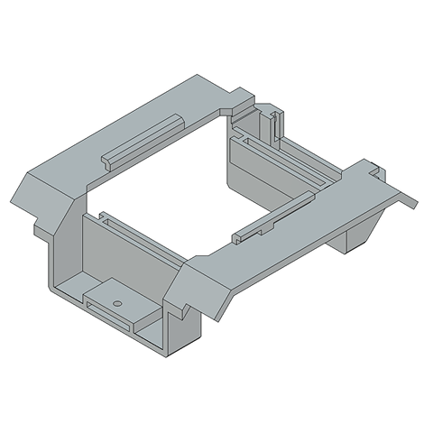 | Rover body base | [rover/parts/body-base.3mf](./../3d-print/rover/parts/body-base.3mf) |  | 1 |
| 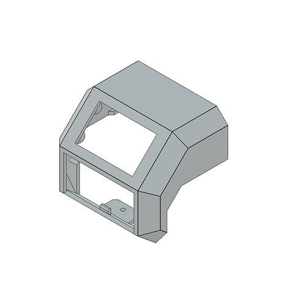 | Rover body front | [rover/parts/body-front.3mf](./../3d-print/rover/parts/body-front.3mf) |  | 1 |
| 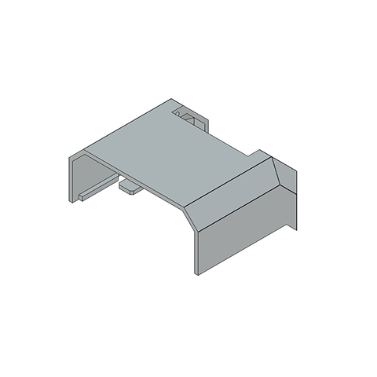 | Rover body back | [rover/parts/body-back.3mf](./../3d-print/rover/parts/body-back.3mf) |  | 1 |
| 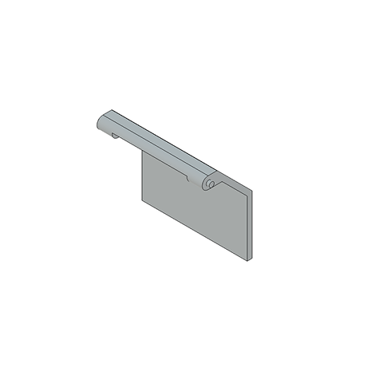 | Rover body back door | [rover/parts/body-back-door.3mf](./../3d-print/rover/parts/body-back-door.3mf) |  | 1 |
| 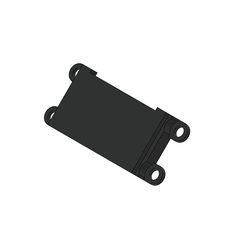 | Rover front glass, variant with light mount niche | [rover/parts/front-glass-light.3mf](./../3d-print/rover/parts/front-glass-light.3mf) | Recommended | 1 |
| 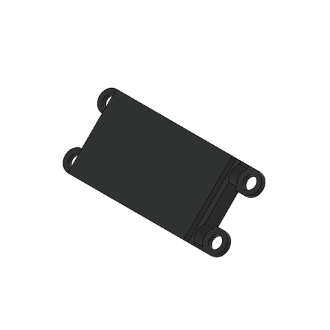 | Rover front glass, blank variant | [rover/parts/front-glass-blank.3mf](./../3d-print/rover/parts/front-glass-blank.3mf) | Alternative | 1 |
| 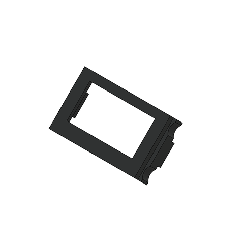 | Rover front glass, variant for OLED screen, front part | [rover/parts/front-glass-oled-front.3mf](./../3d-print/rover/parts/front-glass-oled-front.3mf) | Alternative | 1 |
| 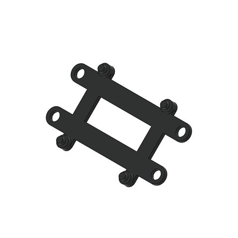 | Rover front glass, variant for OLED screen, back part | [rover/parts/front-glass-oled-back.3mf](./../3d-print/rover/parts/front-glass-oled-back.3mf) | Alternative | 1 |
| 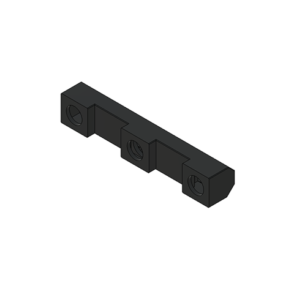 | Rover light mount | [rover/parts/light-mount.3mf](./../3d-print/rover/parts/light-mount.3mf) | Recommended | 1 |
| 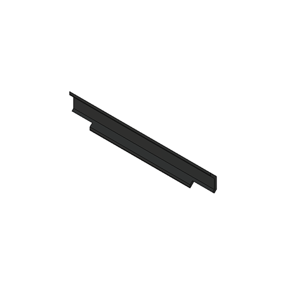 | Rover light mount cover | [rover/parts/light-mount-cover.3mf](./../3d-print/rover/parts/light-mount-cover.3mf) | Recommended | 1 |
| 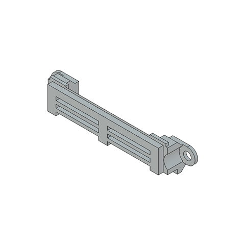 | Rover front add-on slot, top part | [rover/parts/front-slot-top.3mf](./../3d-print/rover/parts/front-slot-top.3mf) | Alternative to gripper | 1 |
| 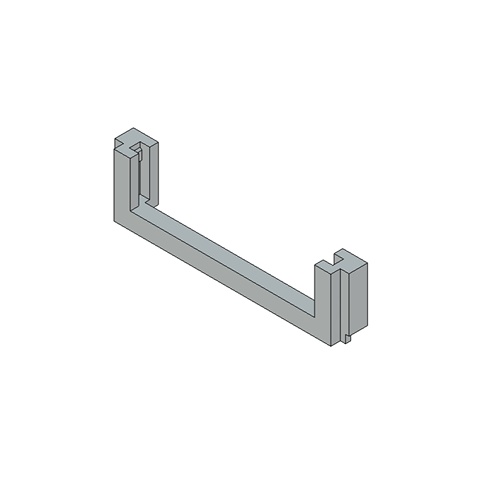 | Rover front add-on slot, bottom part | [rover/parts/front-slot-bottom.3mf](./../3d-print/rover/parts/front-slot-bottom.3mf) | Alternative to gripper | 1 |
| 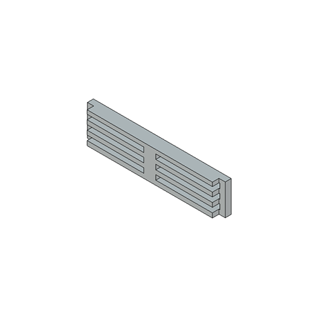 | Rover front add-on slot plug | [rover/parts/front-slot-plug.3mf](./../3d-print/rover/parts/front-slot-plug.3mf) | Alternative to gripper | 1 |
| 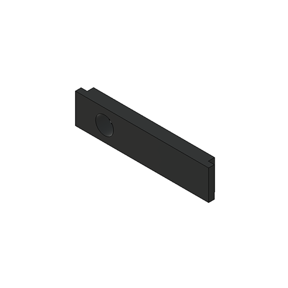 | Rover back antenna mount | [rover/parts/back-antenna-mount.3mf](./../3d-print/rover/parts/back-antenna-mount.3mf) | Recommended for video streaming | 1 |
| 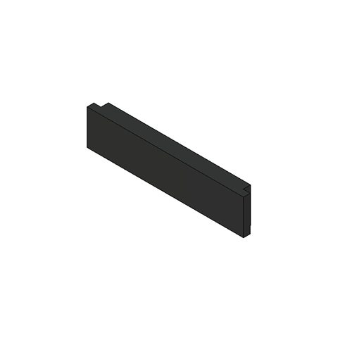 | Rover back add-on slot plug | [rover/parts/back-slot-plug.3mf](./../3d-print/rover/parts/back-slot-plug.3mf) | Alternative | 1 |
| 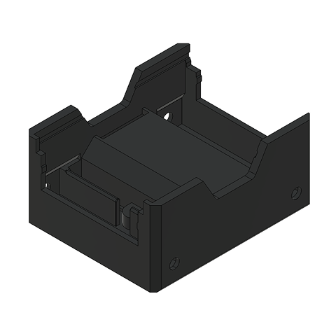 | Rover chassis | [rover/parts/chassis.3mf](./../3d-print/rover/parts/chassis.3mf) | Remixed from [thingiverse.com/thing:2829401](https://www.thingiverse.com/thing:2829401) | 1 |
| 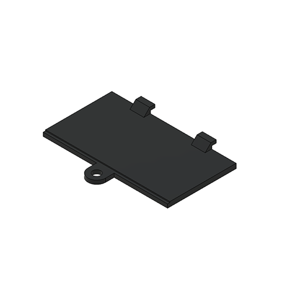 | Rover battery cover | [rover/parts/battery-cover.3mf](./../3d-print/rover/parts/battery-cover.3mf) |  | 1 |
| 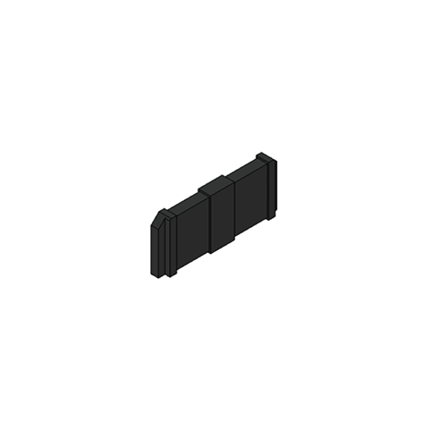 | Rover battery contact pad | [rover/parts/battery-contact.3mf](./../3d-print/rover/parts/battery-contact.3mf) |  | 1 |
| 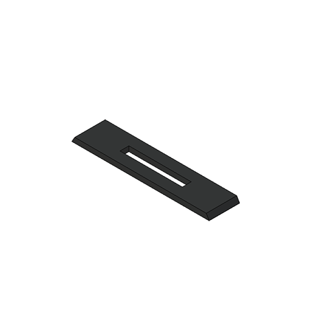 | Rover motor niche locker | [rover/parts/locker-small.3mf](./../3d-print/rover/parts/locker-small.3mf) |  | 1 |
| 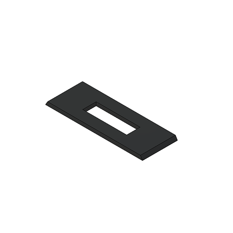 | Rover slave wheel adapter niche locker | [rover/parts/locker-big.3mf](./../3d-print/rover/parts/locker-big.3mf) |  | 1 |
| 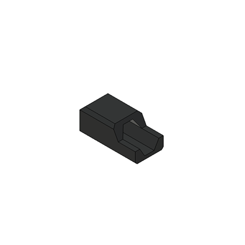 | Rover slave wheel adapter | [rover/parts/m4-adapter.3mf](./../3d-print/rover/parts/m4-adapter.3mf) | Remixed from [thingiverse.com/thing:2829401](https://www.thingiverse.com/thing:2829401) | 2 |
| 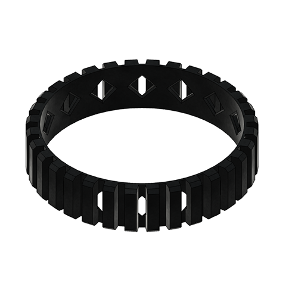 | Rover flex track | [rover/parts/flex-track.3mf](./../3d-print/rover/parts/flex-track.3mf) | Recommended | 2 |
| 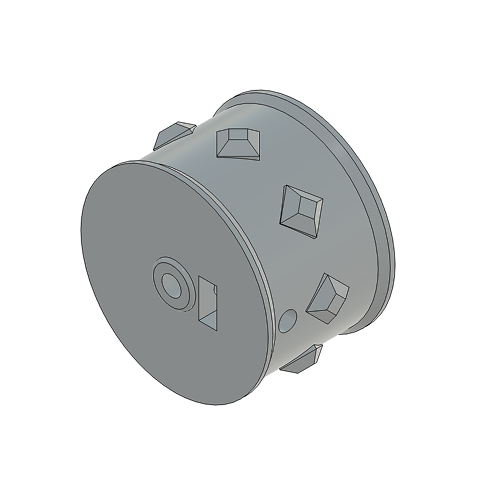 | Rover master wheel with lock for flex track | [rover/parts/flex-track-master-wheel-lock.3mf](./../3d-print/rover/parts/flex-track-master-wheel-lock.3mf) | Recommended, remixed from [thingiverse.com/thing:4686208](https://www.thingiverse.com/thing:4686208) | 2 |
| 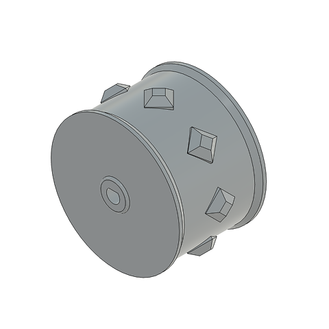 | Rover master wheel for flex track | [rover/parts/flex-track-master-wheel.3mf](./../3d-print/rover/parts/flex-track-master-wheel.3mf) | Alternative, remixed from [thingiverse.com/thing:4686208](https://www.thingiverse.com/thing:4686208) | 2 |
| 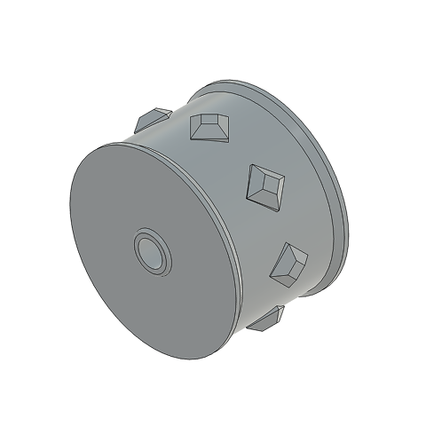 | Rover slave wheel for flex track | [rover/parts/flex-track-slave-wheel.3mf](./../3d-print/rover/parts/flex-track-slave-wheel.3mf) | Recommended, remixed from [thingiverse.com/thing:4686208](https://www.thingiverse.com/thing:4686208) | 2 |
| 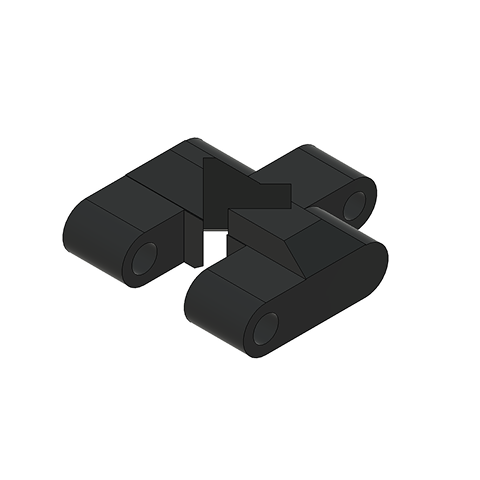 | Rover classic track | [rover/parts/classic-track.3mf](./../3d-print/rover/parts/classic-track.3mf) | Alternative, copied from [thingiverse.com/thing:2662828](https://www.thingiverse.com/thing:2662828) | 16 |
| 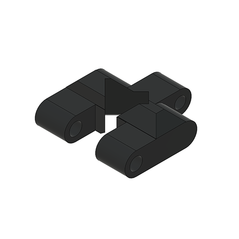 | Rover classic track reflected | [rover/parts/classic-track-reflected.3mf](./../3d-print/rover/parts/classic-track-reflected.3mf) | Alternative, remixed from [thingiverse.com/thing:2662828](https://www.thingiverse.com/thing:2662828) | 16 |
| 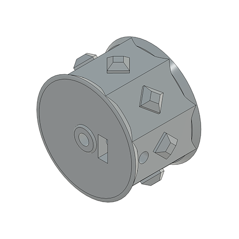 | Rover master wheel with lock for classic track | [rover/parts/classic-track-master-wheel-lock.3mf](./../3d-print/rover/parts/classic-track-master-wheel-lock.3mf) | Alternative, remixed from [thingiverse.com/thing:4686208](https://www.thingiverse.com/thing:4686208) | 2 |
| 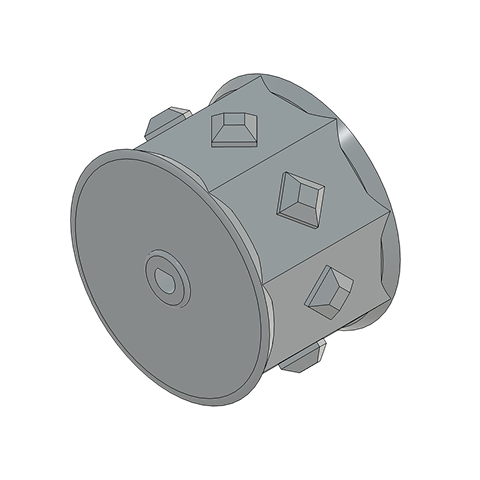 | Rover master wheel for classic track | [rover/parts/classic-track-master-wheel.3mf](./../3d-print/rover/parts/classic-track-master-wheel.3mf) | Alternative, remixed from [thingiverse.com/thing:4686208](https://www.thingiverse.com/thing:4686208) | 2 |
|  | Rover slave wheel for classic track | [rover/parts/classic-track-slave-wheel.3mf](./../3d-print/rover/parts/classic-track-slave-wheel.3mf) | Alternative, remixed from [thingiverse.com/thing:4686208](https://www.thingiverse.com/thing:4686208) | 2 |
| 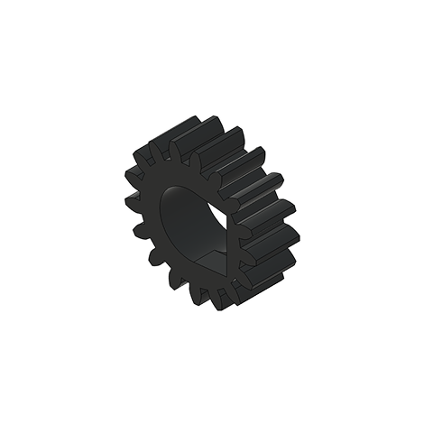 | Rover gripper gear | [rover/parts/gripper-gear.3mf](./../3d-print/rover/parts/gripper-gear.3mf) |  | 1 |
| 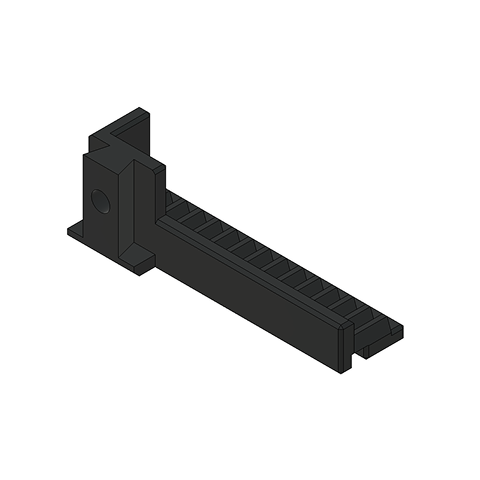 | Rover gripper rack | [rover/parts/gripper-rack.3mf](./../3d-print/rover/parts/gripper-rack.3mf) |  | 2 |
| 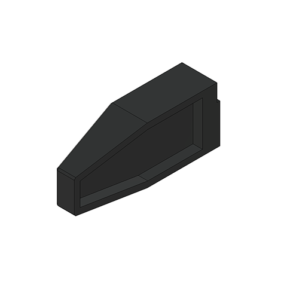 | Rover gripper finger | [rover/parts/gripper-finger.3mf](./../3d-print/rover/parts/gripper-finger.3mf) |  | 2 |
| 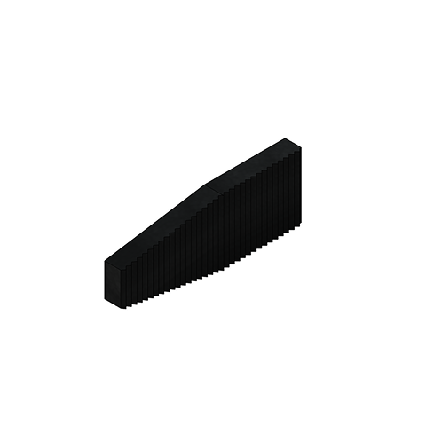 | Rover gripper finger rubber insert | [rover/parts/gripper-finger-rubber.3mf](./../3d-print/rover/parts/gripper-finger-rubber.3mf) |  | 2 |
| 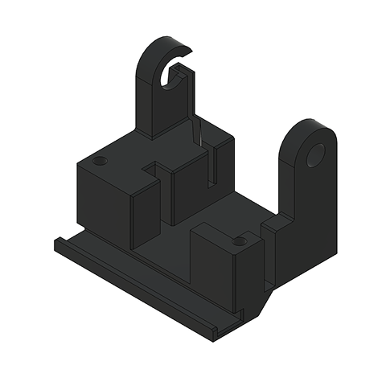 | Rover gripper case base | [rover/parts/gripper-case-base.3mf](./../3d-print/rover/parts/gripper-case-base.3mf) |  | 1 |
| 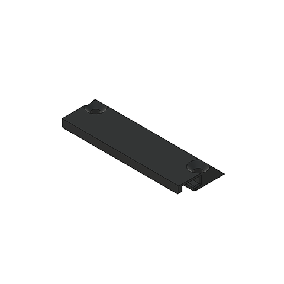 | Rover gripper case cap | [rover/parts/gripper-case-cap.3mf](./../3d-print/rover/parts/gripper-case-cap.3mf) |  | 1 |
| 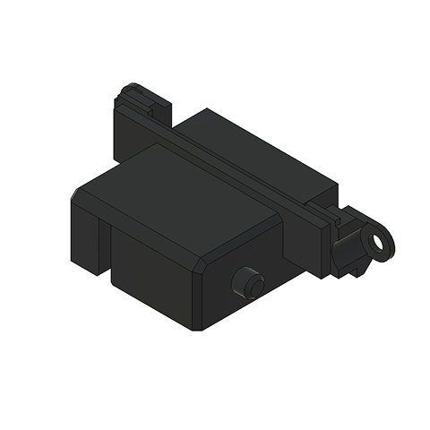 | Rover gripper shoulder case, top part | [rover/parts/gripper-shoulder-case-top.3mf](./../3d-print/rover/parts/gripper-shoulder-case-top.3mf) |  | 1 |
| 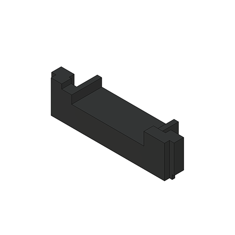 | Rover gripper shoulder case, bottom part | [rover/parts/gripper-shoulder-case-bottom.3mf](./../3d-print/rover/parts/gripper-shoulder-case-bottom.3mf) |  | 1 |
| 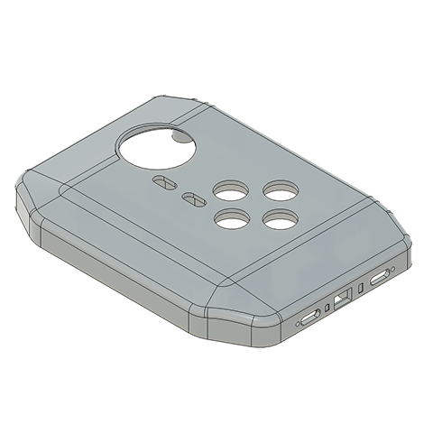 | Remote body, top part | [remote/parts/body-top.3mf](./../3d-print/remote/parts/body-top.3mf) |  | 1 |
| 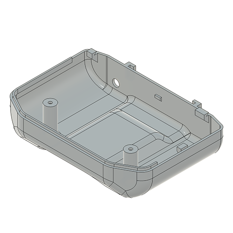 | Remote body, bottom part | [remote/parts/body-bottom.3mf](./../3d-print/remote/parts/body-bottom.3mf) |  | 1 |
| 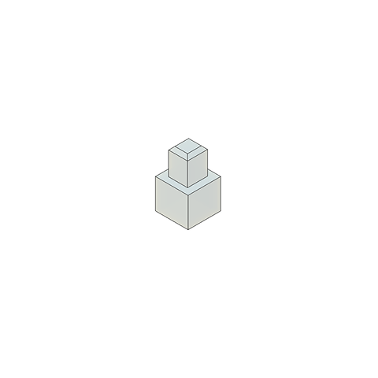 | Remote button connector | [remote/parts/button-connector.3mf](./../3d-print/remote/parts/button-connector.3mf) |  | 4 |
| 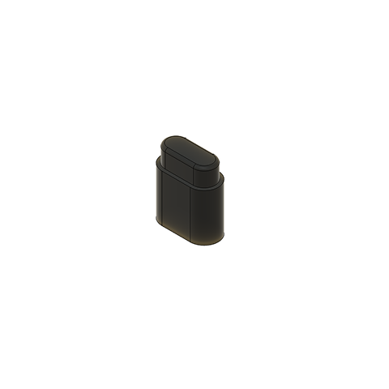 | Remote small button | [remote/parts/small-button.3mf](./../3d-print/remote/parts/small-button.3mf) |  | 2 |
| 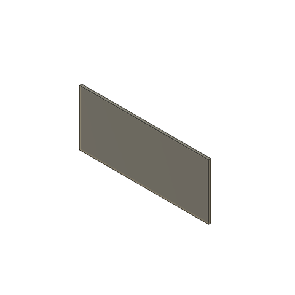 | Remote internal antenna pad | [remote/parts/antenna-pad.3mf](./../3d-print/remote/parts/antenna-pad.3mf) | Alternative | 1 |
| 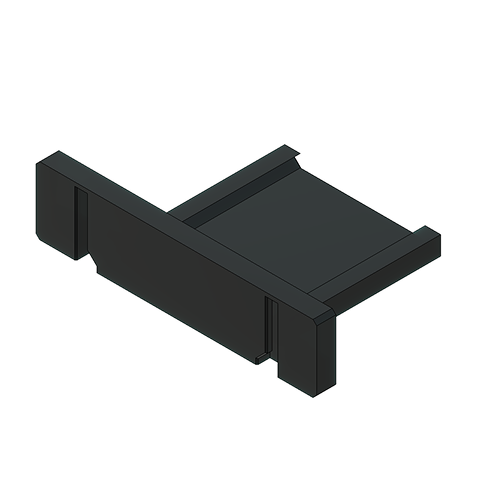 | Remote phone holder base | [remote/parts/phone-holder-base.3mf](./../3d-print/remote/parts/phone-holder-base.3mf) |  | 1 |
| 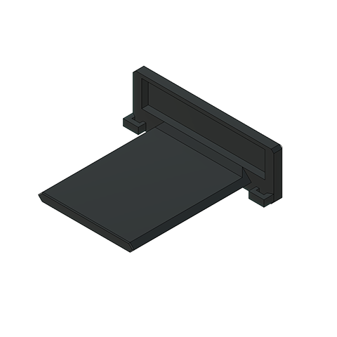 | Remote phone holder cap | [remote/parts/phone-holder-cap.3mf](./../3d-print/remote/parts/phone-holder-cap.3mf) |  | 1 |
| 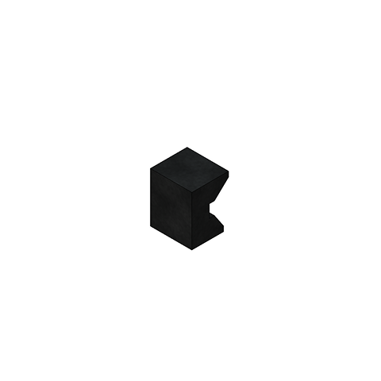 | Remote phone holder base rubber | [remote/parts/phone-holder-base-rubber.3mf](./../3d-print/remote/parts/phone-holder-base-rubber.3mf) |  | 2 |
| 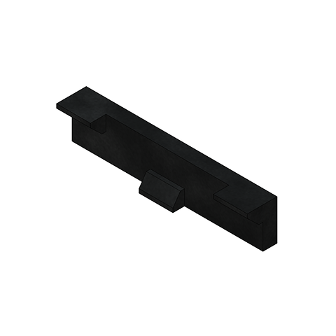 | Remote phone holder cap rubber | [remote/parts/phone-holder-cap-rubber.3mf](./../3d-print/remote/parts/phone-holder-cap-rubber.3mf) |  | 1 |

The rover body and chassis are compatible and interchangeable with parts from the original SMARS robot project and most of its add-ons.
All parts are designed to stay compatible with the existing SMARS robot project, preserving its modularity and extensibility.
All parts except the flexible ones are designed to be printed in PETG on modern, precise 3D printers, so tolerances are minimal.
