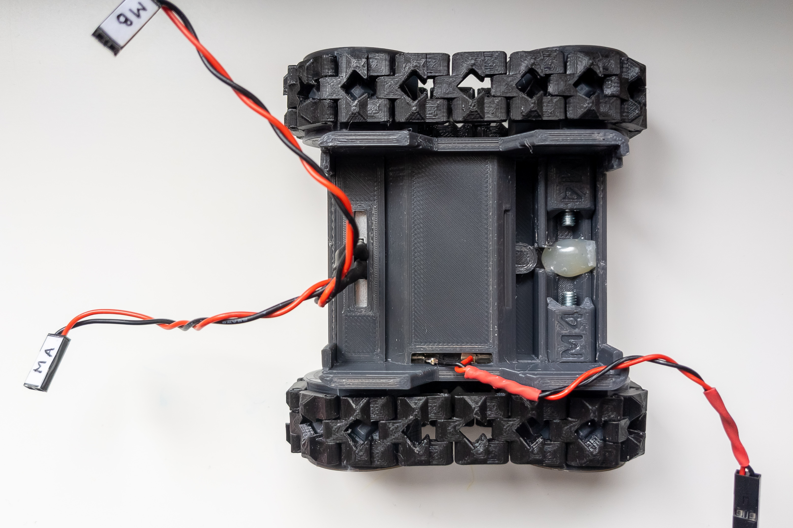
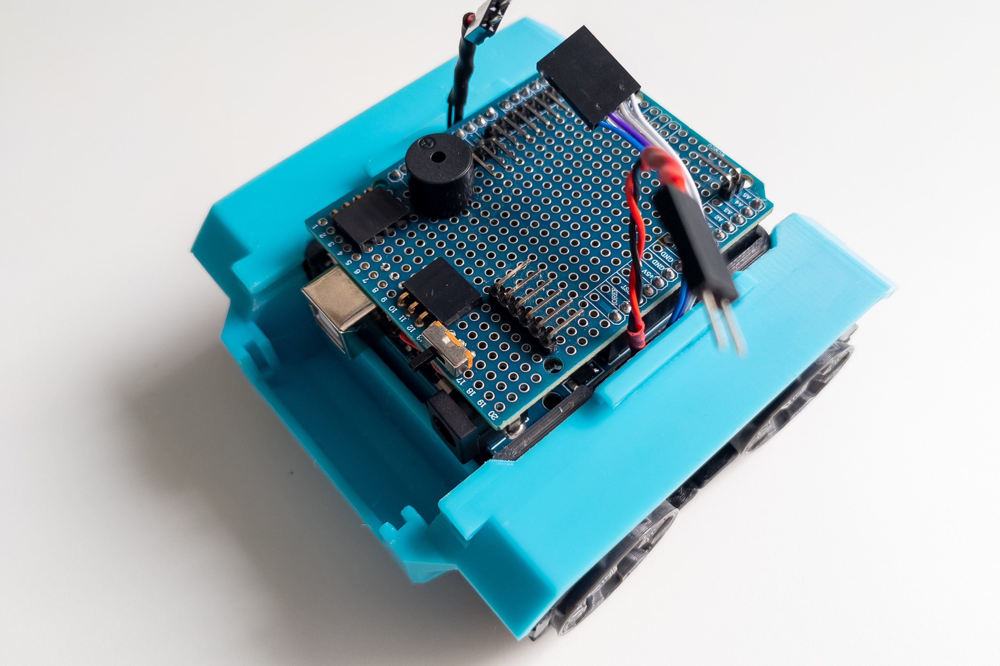

Assembly
========

There are a lot of possible arrangements of SMARS robot depending on parts you already have, parts you can obtain, and add-ons you plan to apply. 
The variant of assembly provided below is just one of the possible options. It was adjusted and carefully checked so I can recommend it, but it doesn't mean that other options are wrong. Go ahead and make your own unique version of the robot and share it with the community!

Anyway, everyone may find some helpful advice or ideas. Let's begin!

Chassis
-------

### Step 1

Print all parts from the `chassis-14500` folder in a single copy.

### Step 2

Attach 2 pieces of nickel strip to the battery pad to make the connectors for batteries.

Solder two wires to the battery connectors. The other end of the wire should have a male Dupont connector.

It is advisable to slightly bend the stripe of the negative connector in the middle area to ensure the best contact with the battery.

### Step 3

Insert a piece of nickel stripe into the chassis, opposite the battery pad mounting location, for closing the circuit of the power supply.

There are special grooves on the chassis for fixing the stripe.

It is also desirable to bend the stripe slightly in the area of the negative contact of the battery.

### Step 4

Important: Make sure the wires of the battery pad are not short-circuited and cannot accidentally short-circuit.

Install the battery pad into the chassis. Slide the wires through the hole in the chassis.

Install 2 14500 batteries in the battery niche.

Check the voltage at the connector.

If there is voltage, and it is around 7.4V, then everything is assembled correctly and you can remove the batteries and move on to the next step.

### Step 5

Solder wires to motors if not already there. When soldering, direct the wires upward so they will not rest against the second motor and will not bend too much.

If you are going to use connections on the motor driver, then the corresponding connectors must be at the ends of the motor wires as well.

Install both motors in the small motor niche, with wires directed up.

Mount small locker.

### Step 6

Print 2 master and 2 slave wheels (`wheels` folder), 16 normal tracks and 16 reflected tracks (`track` folder), and 2 M4 adapters from this project [thingiverse.com/thing:2829401](https://www.thingiverse.com/thing:2829401).

Assemble the right and left tracks using filament pieces with a diameter of 1.75mm.

Mount the master wheels on the motor shafts.

If you using master wheels with lock, fix them with flat head screws and square nuts

Install 2 adapters in the large motor niche, for reliability, it is advisable to fix the adapters with hot melt glue.

Insert the slave wheel into the track and put the track with the wheel onto the master wheel. Fix the slave wheel in the adapter with an M4x20-30 screw and an M4 self-locking nut.

### Step 7

Connect motors, power wires, and signal wires to the motor driver.

The other end of the motor driver power wire should have a male Dupont connector. The other end of the motor driver signal wire should have a female Dupont connector.

Motor A should be left when driving forward, bearing in mind that the small motor niche (where motors are placed now) is located at the back of the robot.

At this step, it is highly recommended to check the correct direction of rotation of the motors. To do this, you can assemble a test bench. It will also be possible to change the direction of rotation programmatically in the future, but it will be much more difficult than swapping the wires when connecting the motor to the driver. It is especially important to check the direction of rotation of the motors if you will be soldering wires to the motor driver directly, without using connectors.

If the tracks are moving in the right direction, you can continue.

Mount motor driver on the large locker.

Mount the large locker itself.

Body
----

### Step 8

Print the body parts from the `body` folder in a single copy. Print the options for the front and face panel parts you plan to use.

### Step 9

Mount the frame on the chassis. 

Arrange the wires from the chassis so that they do not stick out and interfere with the installation and removal of the Arduino. Fix the wires and frame with hot melt glue.

### Step 10

Mount the Arduino on the frame. The connection shield can be installed on the Arduino both before and after mounting on the frame.

### Step 11

Connect the power and signal wires of the motors to the Arduino.

Check that the switch is in the off position and connect the power wires to the Arduino.

Install the Bluetooth module.

At this step, if you have already flashed the firmware to the Arduino, the main functions of the robot should already work. Optionally, you can install batteries and check robot movements, Bluetooth control, and buzzer.

### Step 12

Mount the front and face panels onto the front of the body.

Fix the front panel with screws with pad (screws for computer case), and the face panel with hot melt glue.

Install LED board and distance sensor.

Connect the wires to the distance sensor, you may need to bend the pins a little. Both ends of the distance sensor wires should have female Dupont connectors.

Fix the distance sensor with hot melt glue. It, in turn, will fix the LED board.

### Step 13

Mount the front of the body onto the frame.

Connect wires from LED board and distance sensor to Arduino.

### Step 14

Mount the back door on the back of the body with two pieces of 1.75mm filament.

Place the back of the body onto the frame.

### Step 15

Check that the switch is in the off position and install the batteries.

Fix the front case and the battery cover with the screws with pad.

### Step 16

Flash the firmware to the Arduino if you haven't already. The USB cable can be connected without disassembling the robot by opening the back door.

Turn on the power switch and put your robot to the test!

