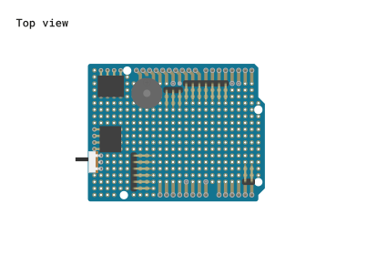
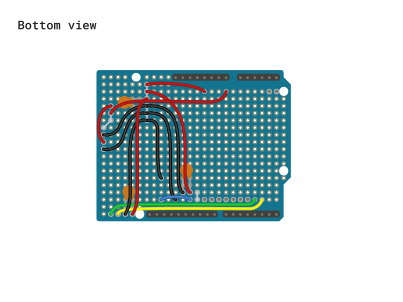
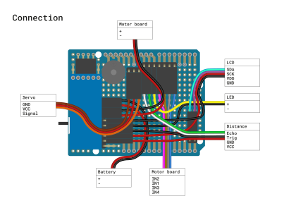
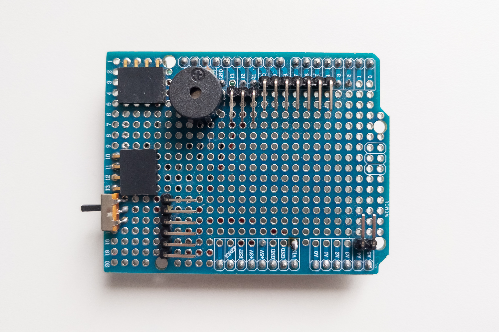
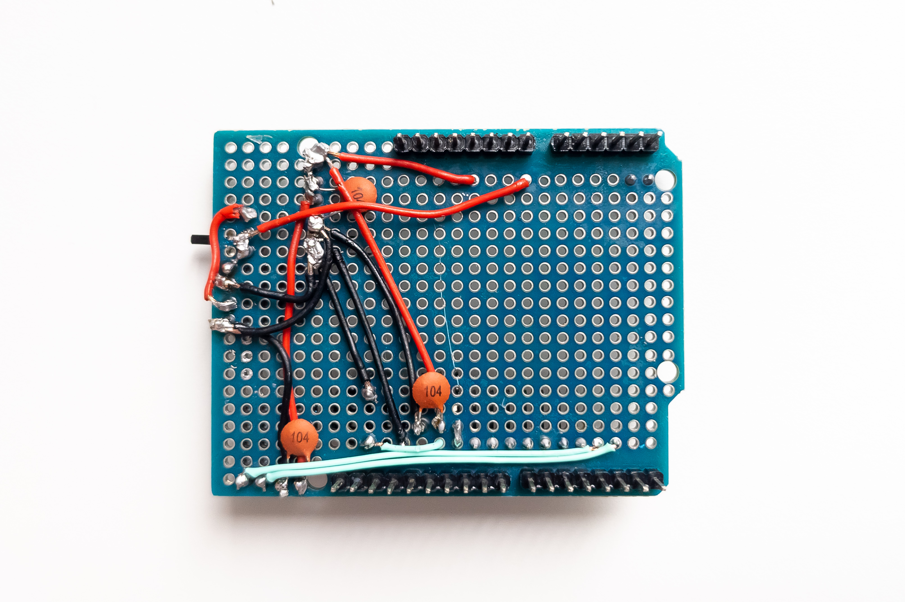
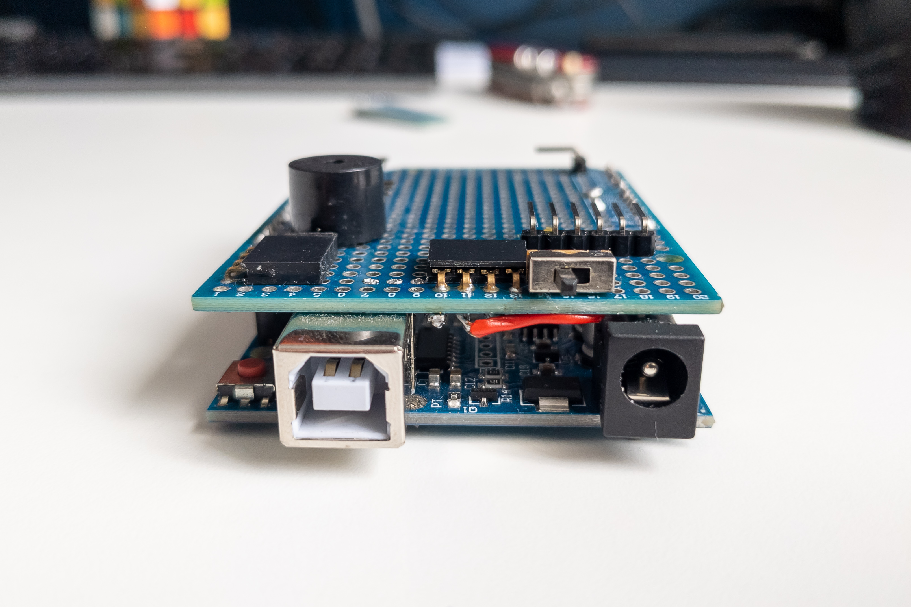
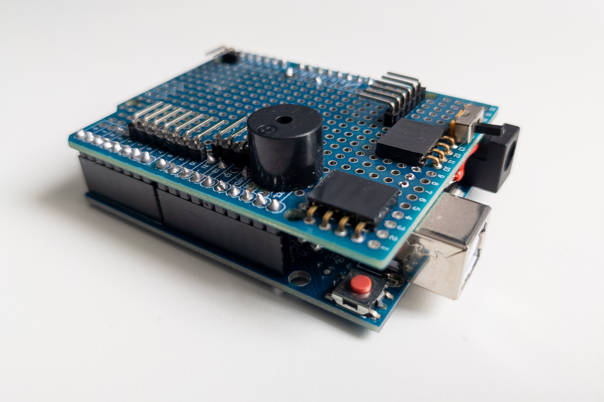

Сonnection shield
=================

The connection shield is designed to conveniently connect motors, batteries, and accessories to the Arduino. The Connection shield will give a finished look to your project, allow you to connect and disconnect electronics using connectors, without soldering, and also allows you to install a buzzer and a power switch on the board.

You cannot buy such a board in a store, but it is not so difficult to make it yourself. Very few components are required with minimal costs. Also, assembling your connection shield is good training for soldering skills.

Features
--------

* Connecting batteries
* Connecting motor driver, signal, and power
* Connecting Bluetooth module
* Connecting servo motor
* Connecting LED light
* Connecting Ultrasonic Distance Sensor
* Connecting an I²C (IIC) display
* Possibility of installing buzzer on the board
* Possibility of installing power switch on the board

Required components
-------------------

* Breadboard with Arduino Uno shield form - 1pc
* 2.54mm male pin header strip (if not included with the breadboard) - 1x40pin
* 2.54mm right angle male pin header strip - 1x20pin
* 2.54mm right angle female socket header strip - 1x10socket
* Buzzer - 1pc
* Power switch - 1pc
* Ceramic capacitor 0.1uF (often labeled as 104) - 3pc

Assembly diagram
----------------

### Top view

**Note:**

To mount the buzzer, the trace on the breadboard leading to SDA pin (near reset button) should be removed first. It will free the corresponding contact on the breadboard for soldering wire. 

### Bottom view

**Note:**

The scheme above is designed for use with 14500 or 9V batteries. Battery positive pole connects to Vin pin. Vin pin is designed to work with 7-12V voltage which passed through the converter. In this case, the +5V pin acts as an output pin and powers all other devices except motor board.

For using AAA batteries, battery positive pole should be connected directly to the +5V pin for bypassing the converter. +5V pin designed to work with 5V only (4.5V is also acceptable but not more than 5V) and in this case it acts as input pin and powers Arduino from the same bus as all other devices. To achieve this, the wire from the switch should be connected to the contact on the board corresponding to the +5V pin instead of the Vin pin, so that all positive power wires were closed.

Connection diagram
------------------

### Pinout

| Arduino pin | Device pin                                                  |
|-------------|-------------------------------------------------------------|
| VIN         | BAT:+, MB:+                                                 |
| +5V         | LCD:VDD, BT:VCC, DS:VCC, SRV:VCC                            |
| GND         | BAT:-, MB:-, LCD:GND, BT:GND, DS:GND, SRV:GND, LED:-, BUZ:- |
| A4          | LCD:SDA                                                     |
| A4          | LCD:SDA                                                     |
| A5          | LCS:SCK                                                     |
| D2          | BT:TX                                                       |
| D3          | BT:RX                                                       |
| D4          | MB:IN4                                                      |
| D5          | MB:IN3                                                      |
| D6          | MB:IN1                                                      |
| D7          | MB:IN2                                                      |
| D8          | LED:+                                                       |
| D9          | DS:TRIG                                                     |
| D10         | DS:ECHO                                                     |
| D11         | SRV:SIG                                                     |
| D12         | BUZ:+                                                       |

Photos
------

In progress
-----------

PCB layout for manufacture production is in progress. Stay tuned and welcome to help with development.
