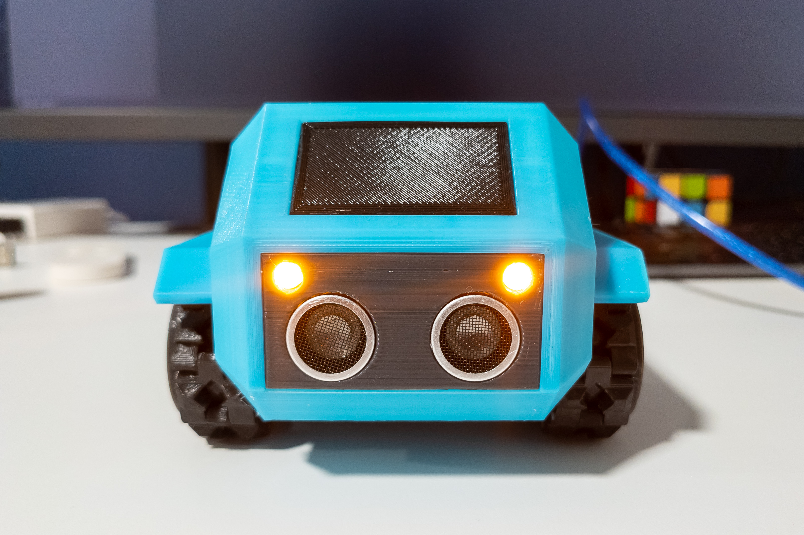

LED board
=========

Adding headlights to the robot could make it more interesting for play and will make it look really great. And it is so simple!

This is the one of possible options but it was designed to fit together with a distance sensor into included face panel.

Required components
-------------------

* Breadboard 60x40 (20x14 holes) - 1pc
* Yellow LED 5mm - 2pc
* Resistor 47ohm - 1pc

**Note:**

Resistor calculated for the exactly 2 yellow 5mm LEDs. If you are going to use a different LED (color or size) most likely you will need a different resistor.
Yellow LED was chosen because it can be powered from one pin and needed amperage matches Arduino's recommended.

Assembly diagram
----------------

The size of the LED board after cutting the breadboard is 54x3mm (20 holes).

The length of the LED contacts should be minimal but at the same time enough to bend the LED 90° and not rest against the board.

**Note:**

The layout of the bord was precisely arranged with positions of other parts in mind, distance sensor, LCD, and even ESP32-CAM. If you are going to change something, take into account that it is not so much room left for LED.

Photos
------

