Parts list
==========

| Image | Part name | Used in / Comments | Links | Quantity |
|-------|-----------|--------------------|-------|----------|
| 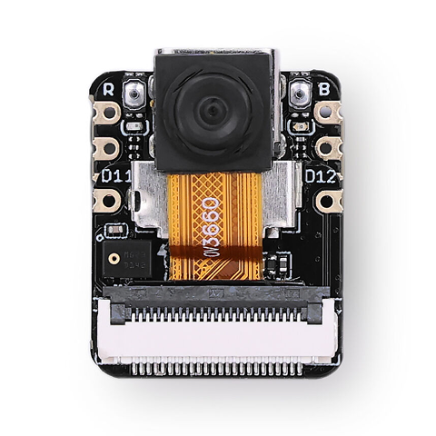 | Seeed Studio XIAO ESP32-S3 Sense | Rover, the camera sensor board is required for video streaming | [seeedstudio.com](https://www.seeedstudio.com/XIAO-ESP32S3-Sense-p-5639.html) | 1 |
| 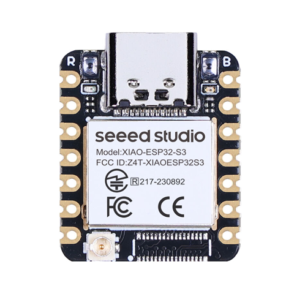 | Seeed Studio XIAO ESP32-S3 | Remote | [seeedstudio.com](https://www.seeedstudio.com/XIAO-ESP32S3-p-5627.html) | 1 |
| 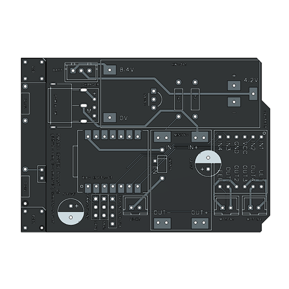 | Custom PCB | Rover, optional, alternatives allowed* | [jlcpcb.com](https://jlcpcb.com/) | 1 |
| 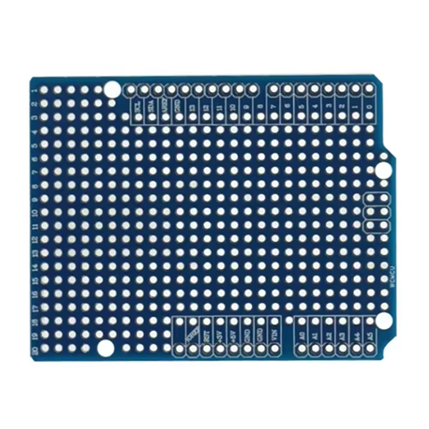 | Prototype PCB Uno R3 | Rover, an alternative to custom PCB | [aliexpress.com](https://aliexpress.com/item/1005009263224615.html) | 1 |
| 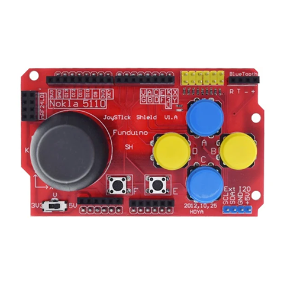 | Joystick shield | Remote | [aliexpress.com](https://aliexpress.com/item/1005005876862901.html) | 1 |
| 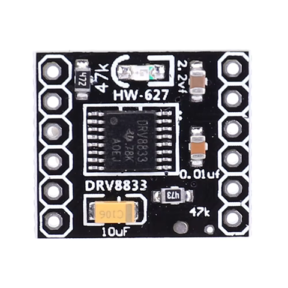 | DRV8833 dual DC motor driver | Rover | [aliexpress.com](https://aliexpress.com/item/1005008581957341.html) | 1 |
| 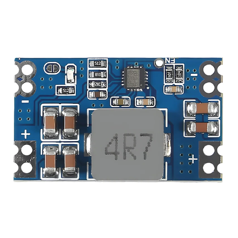 | Mini560 step-down DC-DC converter (5A) | Rover, alternatives allowed* | [aliexpress.com](https://aliexpress.com/item/1005008374043122.html) | 1 |
| 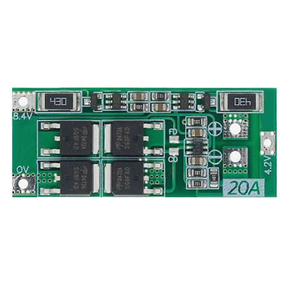 | HW-391 2S balance BMS | Rover, alternatives allowed* | [aliexpress.com](https://aliexpress.com/item/1005006332151598.html) | 1 |
| 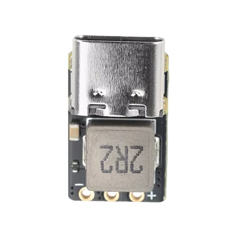 | IP2326 2S/3S charger | Rover, optional, alternatives allowed* | [aliexpress.com](https://aliexpress.com/item/1005009467084475.html) | 1 |
| 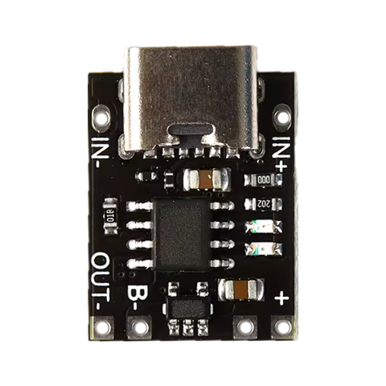 | TP4056 mini 1S charger (Type-C) | Remote, alternatives allowed* | [aliexpress.com](https://aliexpress.com/item/1005004851048196.html) | 1 |
| 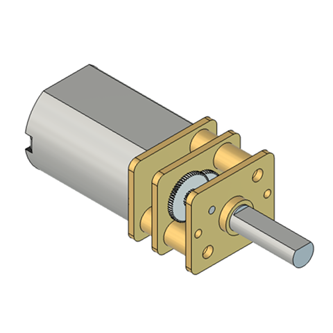 | N20 6V DC gear motor (200 RPM) | Rover | [aliexpress.com](https://aliexpress.com/item/1005006728064342.html) | 2 |
| 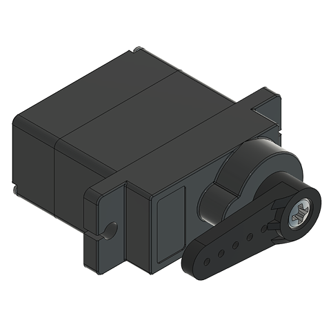 | MG90S micro servo (180°) | Rover, required for gripper. Note: servos come in different shapes, and not all of them fit. | [aliexpress.com](https://aliexpress.com/item/33044819391.html) | 2 |
| 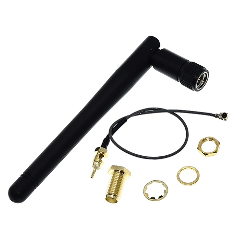 | Wi-Fi antenna 2.4GHz, IPEX | Rover, Remote, recommended for video streaming | [aliexpress.com](https://aliexpress.com/item/1005006297440958.html) | 2 |
| 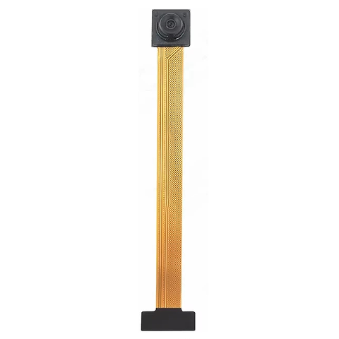 | OV3660 camera, 75mm (120°) | Rover, required for video streaming, alternatives allowed* | [aliexpress.com](https://aliexpress.com/item/1005006846294692.html) | 1 |
| 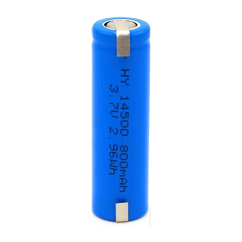 | 14500 Li-ion battery 800mAh | Rover, Remote, alternatives allowed* | [aliexpress.com](https://aliexpress.com/item/1005001984637431.html) [aliexpress.com](https://aliexpress.com/item/1005009607272016.html) | 3 |
| 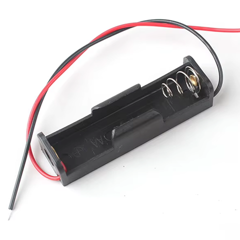 | 1S AA battery holder | Remote | [aliexpress.com](https://aliexpress.com/item/1005008680112094.html) | 1 |
| 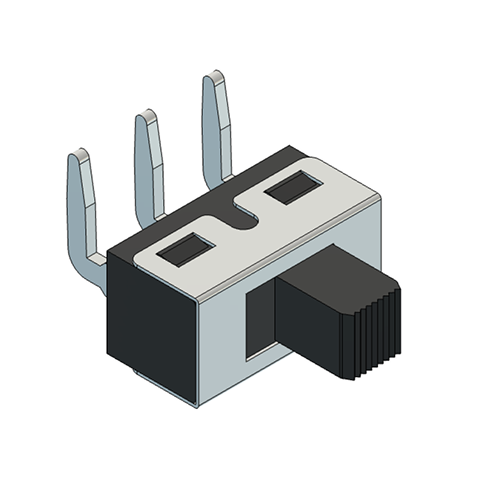 | SS12D11 toggle switch | Rover, Remote, alternatives allowed* | [aliexpress.com](https://aliexpress.com/item/1005002546022458.html) | 2 |
| 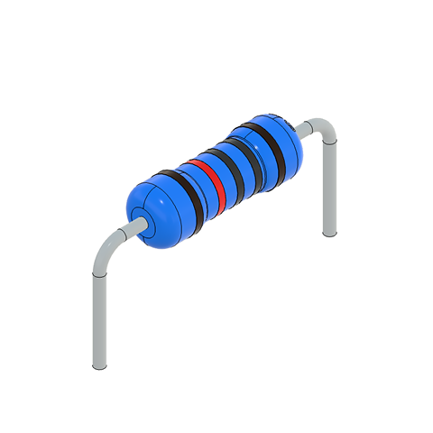 | Resistor 100Ω | Rover, required for light |  | 2 |
|  | Resistor 1000Ω | Rover, required for light |  | 1 |
|  | Resistor 10KΩ | Rover, required for light |  | 1 |
| 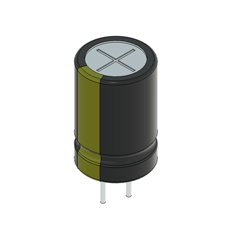 | Capacitor 220µF | Rover |  | 1 |
|  | Capacitor 100µF | Rover, optional |  | 1 |
| 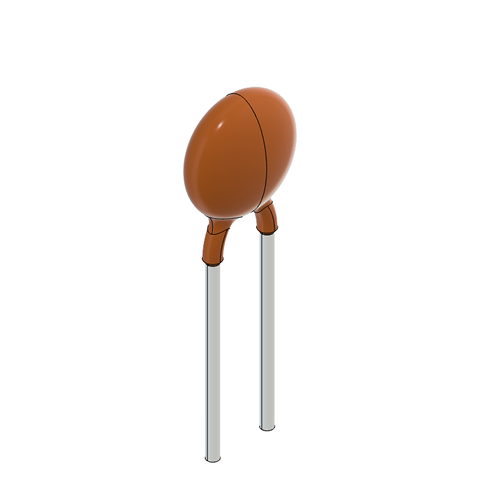 | Capacitor 10nF | Rover, optional | | 2 |
| 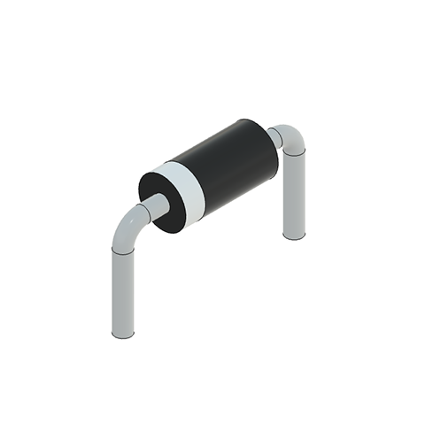 | Schottky diode 1N5819 | Rover, alternatives allowed* |  | 1 |
| 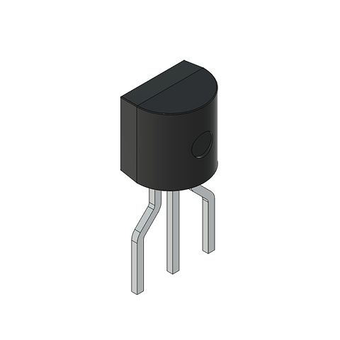 | NPN transistor S8050 | Rover, required for light, alternatives allowed* |  | 1 |
| 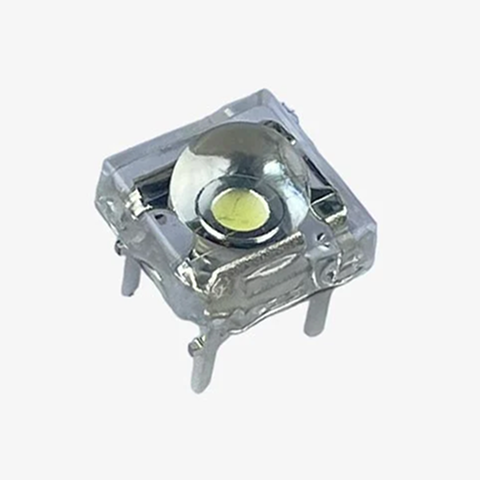 | Piranha LED 5mm white | Rover, required for light, alternatives allowed* | [aliexpress.com](https://aliexpress.com/item/1005002270502759.html) | 2 |
| 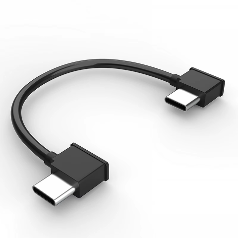 | OTG data cable | Rover, Remote, required for video streaming | [aliexpress.com](https://aliexpress.com/item/1005012334389121.html) | 1 |
| 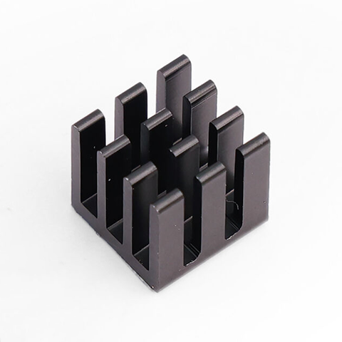 | Aluminum heatsink 10x10x10mm | Rover, recommended for video streaming | [seeedstudio.com](https://www.seeedstudio.com/Aluminum-Heat-Sink-For-XIAO-2pcs-p-5972.html) [aliexpress.com](https://aliexpress.com/item/4000299061064.html) | 2 |
| 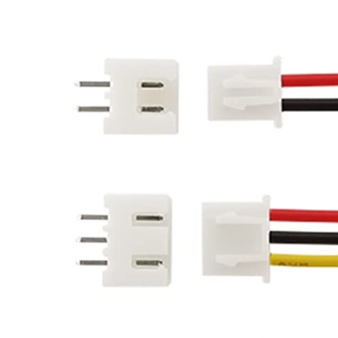 | JST XH2.54 connectors (2P, 3P) | Rover, optional. Note: requires an SN-2549 crimper. | [aliexpress.com](https://aliexpress.com/item/1005010378625298.html) |  |
| 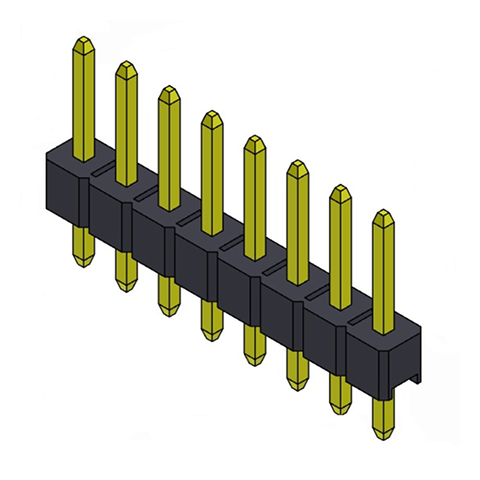 | 2.54mm male pin header | Rover, optional | [aliexpress.com](https://aliexpress.com/item/4000694199194.html) |  |
| 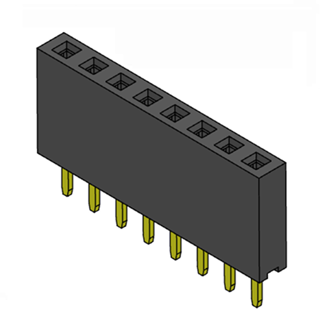 | 2.54mm female header | Rover, optional | [aliexpress.com](https://aliexpress.com/item/4000523047541.html) |  |
| 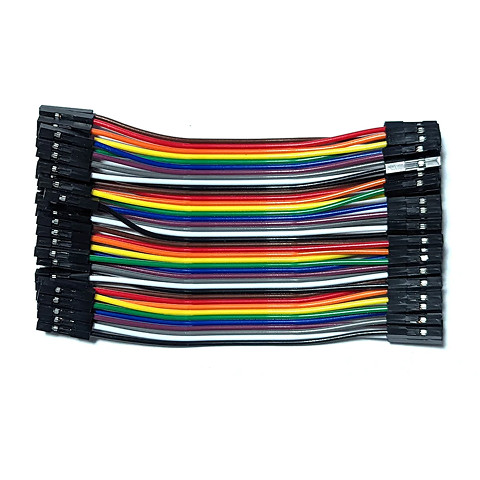 | Wires with Dupont connectors (female-female) | Remote |  |  |
| 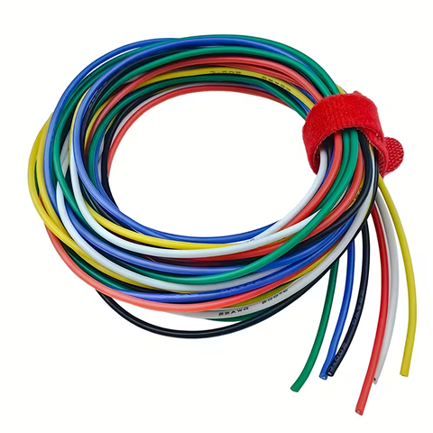 | Wires without connector | Rover, Remote |  |  |
| 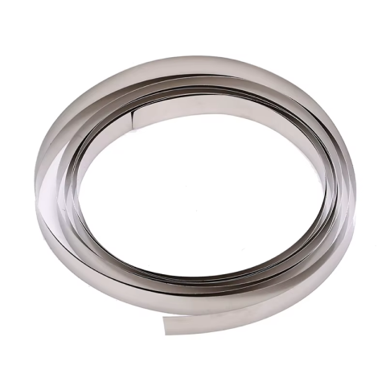 | Nickel strip | Rover | [aliexpress.com](https://aliexpress.com/item/32905320656.html) |  |
| 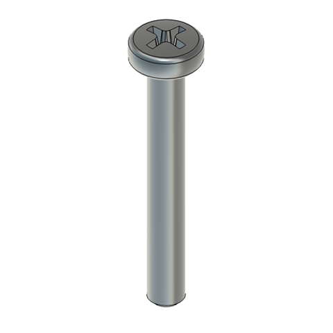 | M4x30 screw | Rover |  | 2 |
| 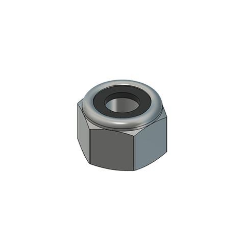 | M4 self-locking nut | Rover |  | 2 |
| 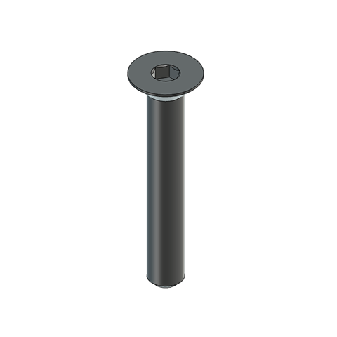 | M3x20 flat head screw | Rover, required for gripper |  | 2 |
| 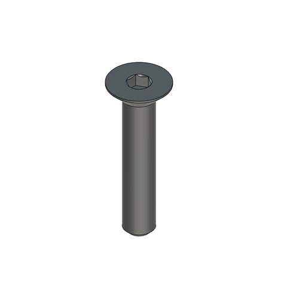 | M3x16 flat head screw | Rover, required for gripper |  | 2 |
| 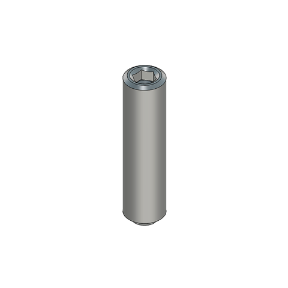 | M3x12 set screw | Rover, optional |  | 2 |
| 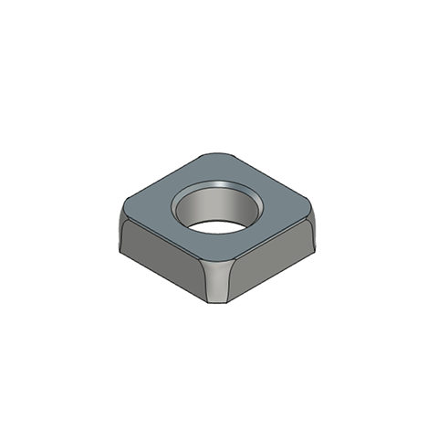 | M3 square nut | Rover, optional |  | 2 |
| 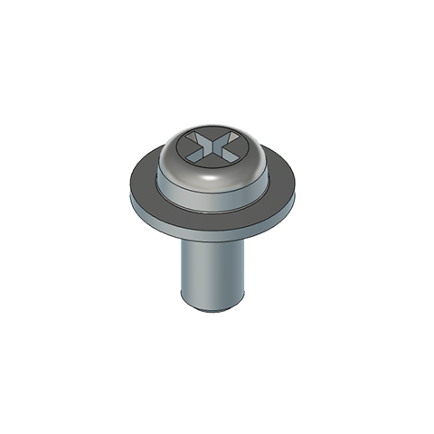 | M3x5 screw with pad (screw for computer case) | Rover, alternatives allowed* |  | 11 |
| 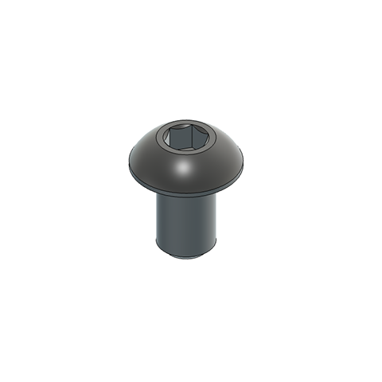 | M3x5 screw | Remote, can also be used as an alternative to the M3x5 screw with pad |  | 2 |
| 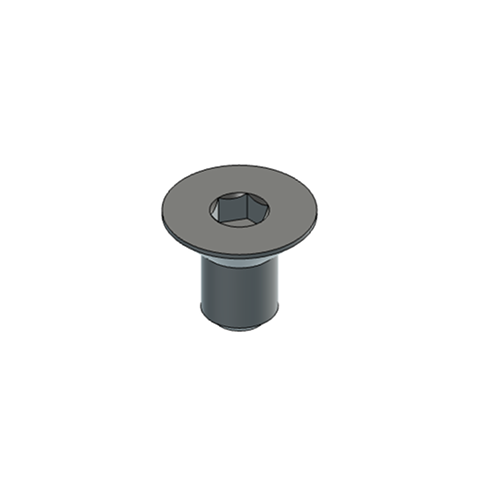 | M3x5 flat head screw | Remote |  | 1 |
| 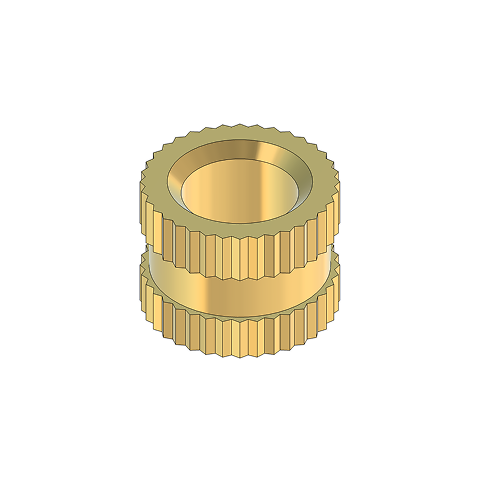 | M3 insert nut | Rover, Remote, optional* |  | 12 |

* — these parts may require adjustments to the 3D-printed models.

Links are not referrals and are provided for reference. Feel free to buy components wherever you like.
