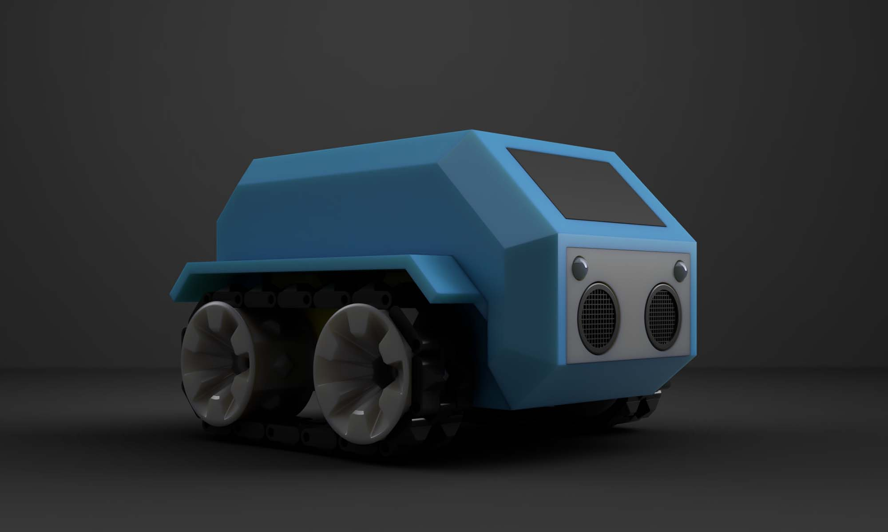
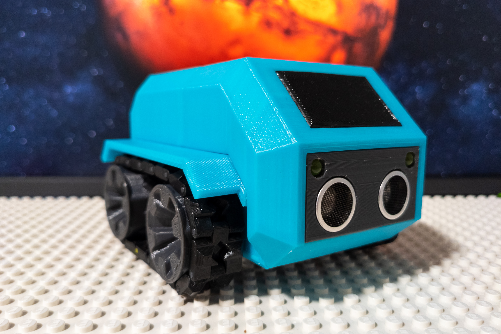
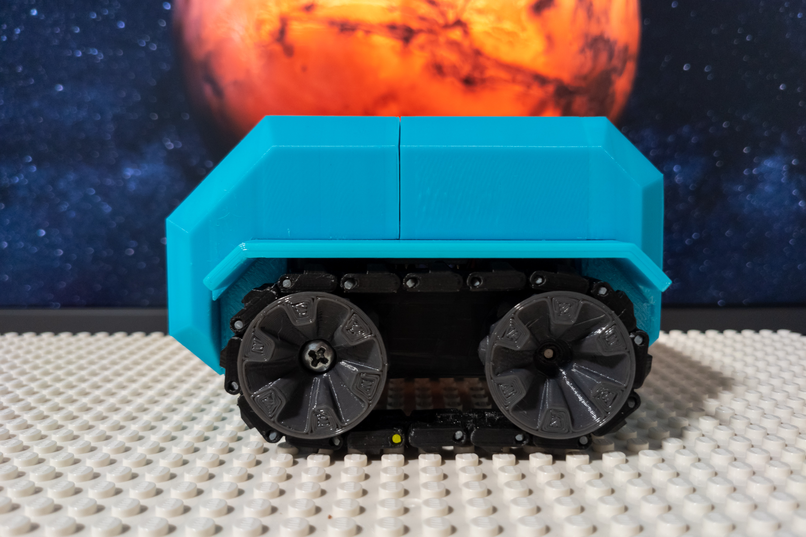
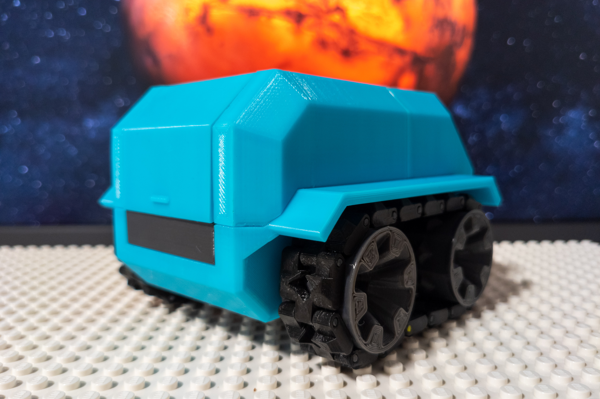

sMARS rover
===========

About the project
-----------------

sMARS rover is a decent body for the SMARS modular robot. SMARS robot is really great project with a lot of add-ons and a big community behind it.

SMARS is a perfect project for start learning robotics and practice in 3D printing as well. And if after all, you would like your robot looks awesome, sMARS rover is a good option to try. Also, sMARS rover is good if you building a robot for kids.

sMARS rover was inspired by Jaxa Lunar rover by Toyota, Mars rover from the Martian movie, and the SMARS robot project of course.

Project features
----------------

* Good looking body which represents robot as Mars rover
* Full compatibility with SMARS robot and most add-ons
* Modular design, various addons still can be mounted
* Mount with standard screws for computer cases
* Includes source files for further improvements
* Includes examples of electronic assembles - connection shield, LED light
* Includes code examples including Bluetooth control
* Includes documentation for assembling and electronic parts

Additional SMARS add-ons
------------------------

* Chassis for holding 2x14500 batteries. Also has a space for a mini motor driver board.
* Improved wheel with screw lock
* Reflected truck for reducing movement distortion

All add-ons are optional for sMARS rover, every add-on including the body itself can be used independently.

Models for 3D printing on Thingiverse: [thingiverse.com/thing:5028894](https://www.thingiverse.com/thing:5028894). The same files are also placed in [3d-print](/3d-print) folder of this repo.

SMARS project and mods
----------------------

### Main project

SMARS modular robot - [thingiverse.com/thing:2662828](https://www.thingiverse.com/thing:2662828) or [cults3d.com/en/3d-model/gadget/smars-modular-robot](https://cults3d.com/en/3d-model/gadget/smars-modular-robot).

### Mods with checked compatibility with sMARS rover

* 4wd chasis - [thingiverse.com/thing:2829401](https://www.thingiverse.com/thing:2829401)
* AAA batteries holding board (with space for a mini motor driver board) - [thingiverse.com/thing:2762630](https://www.thingiverse.com/thing:2762630) or [cults3d.com/en/3d-model/gadget/3a-batteries-mod-for-smars](https://cults3d.com/en/3d-model/gadget/3a-batteries-mod-for-smars)
* Showel mode - [thingiverse.com/thing:4238338](https://www.thingiverse.com/thing:4238338)

Documentation
-------------

You can find the documentation in [docs](/docs) folder of this repo or here [i-amdroid.github.io/smars-rover/](https://i-amdroid.github.io/smars-rover/).

Documentation sections:

* [Electronic parts](/docs/hardware.md)
* [3d printable parts](/docs/3d-print.md)
* [Code](/docs/software.md)

Photos
------

In progress
-----------

The project is under active development. Stay tuned and welcome for any help or contribution.

More photos and probably video are to come.
