SMARS ROVER
===========

About the project
-----------------

SMARS ROVER is a modular robotic rover with a finger gripper, controlled remotely over a video stream and powered by an ESP32.
It is built on top of SMARS, an extendable modular robot with plenty of add-ons and a large community behind it.
The design was inspired by Toyota's JAXA lunar rover, the Mars rover from The Martian, and the original SMARS project.

Project features
----------------

* A complete, working project — free and open source
* Fully compatible with the SMARS robot project and most of its add-ons
* Rover body v3, carefully designed based on years of experience
* Improved chassis with support for a Li-ion battery and charging
* Flexible tracks and redesigned wheels
* Finger gripper that moves in two dimensions
* Custom PCB for a polished, professional build
* Remote powered by either a battery or a smartphone
* Remote control over ESP-NOW, with a range of up to 100 meters
* Video streaming over the USB webcam protocol, used to drive the rover and the gripper

Gallery
-------

| | | |
|---|---|---|
| 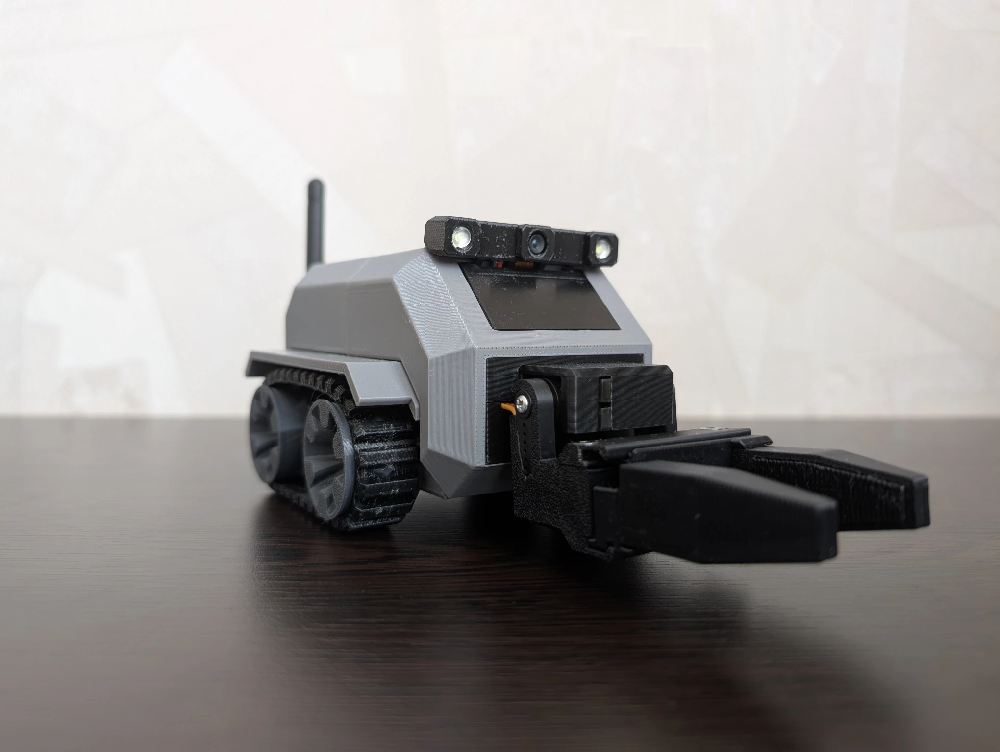 | 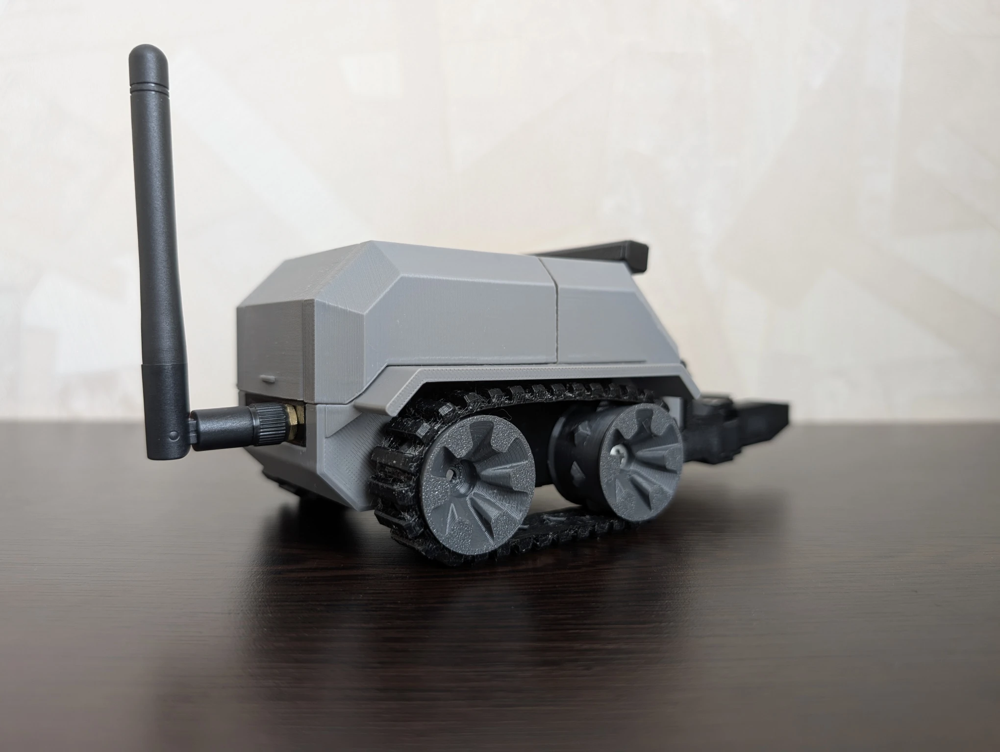 | 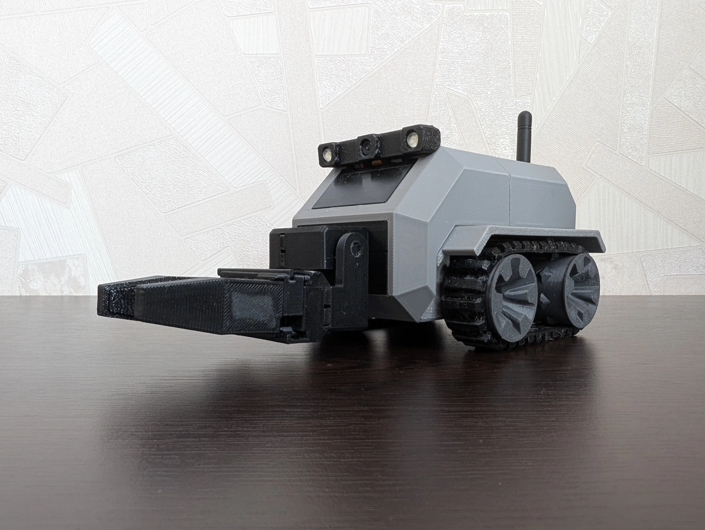 |
| 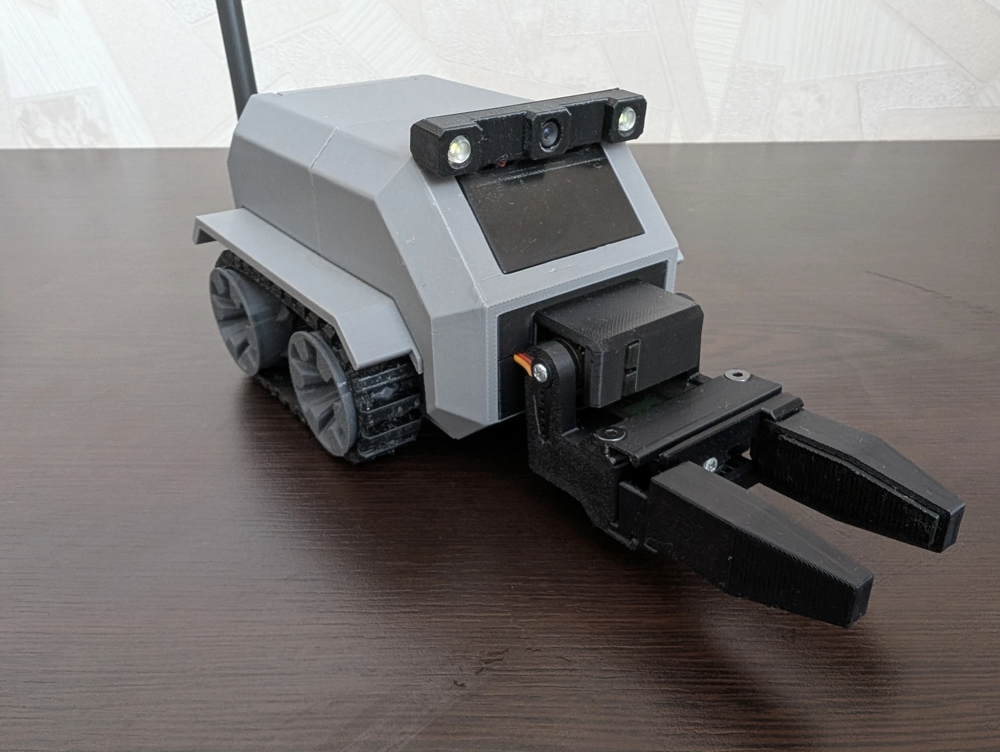 | 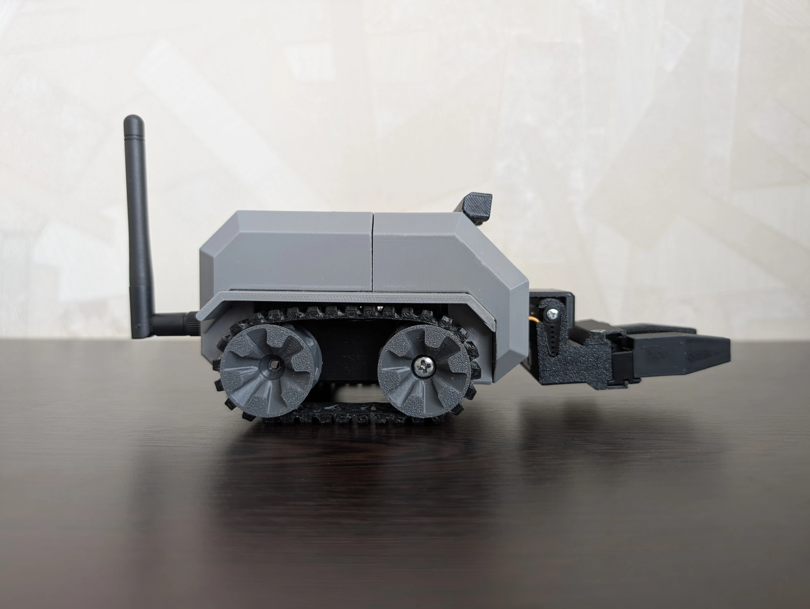 | 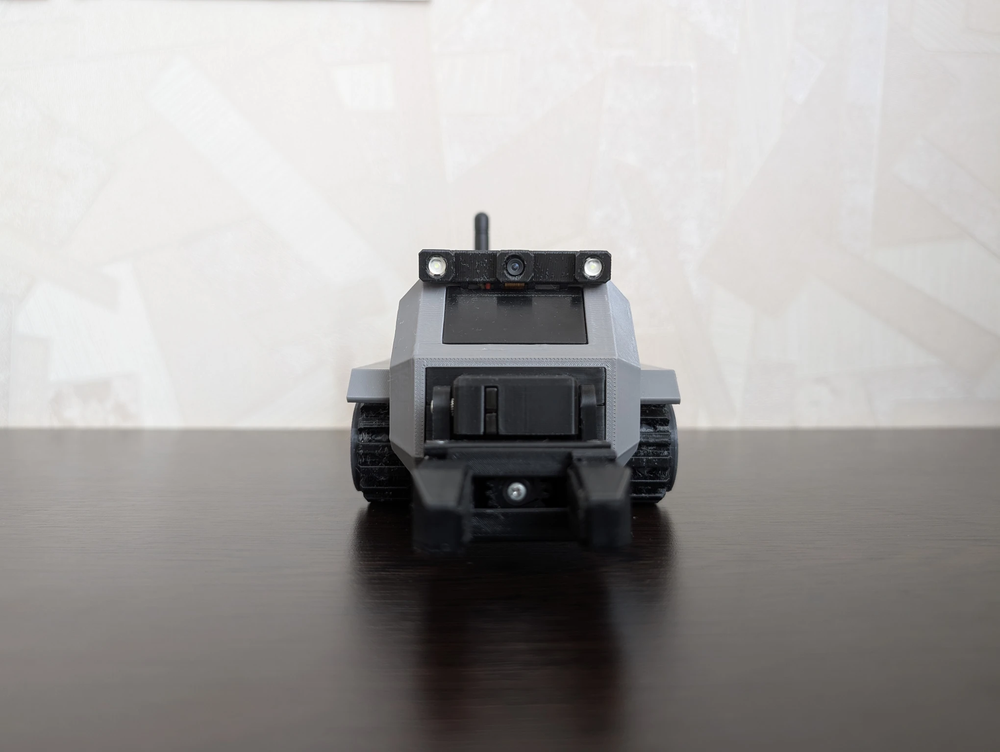 |
| 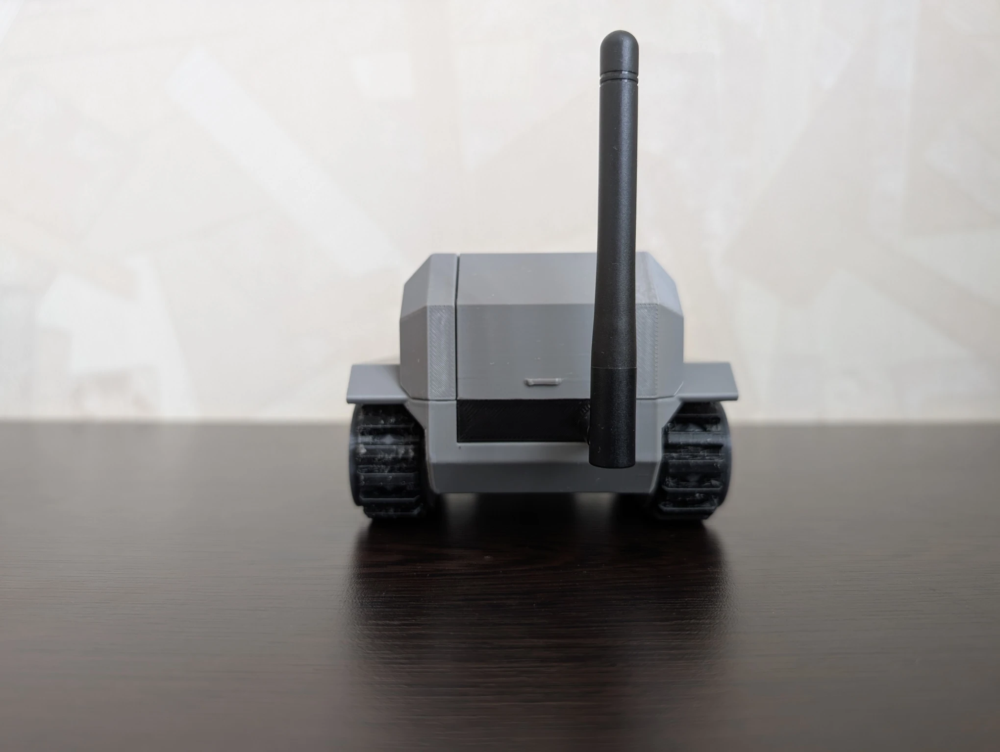 | 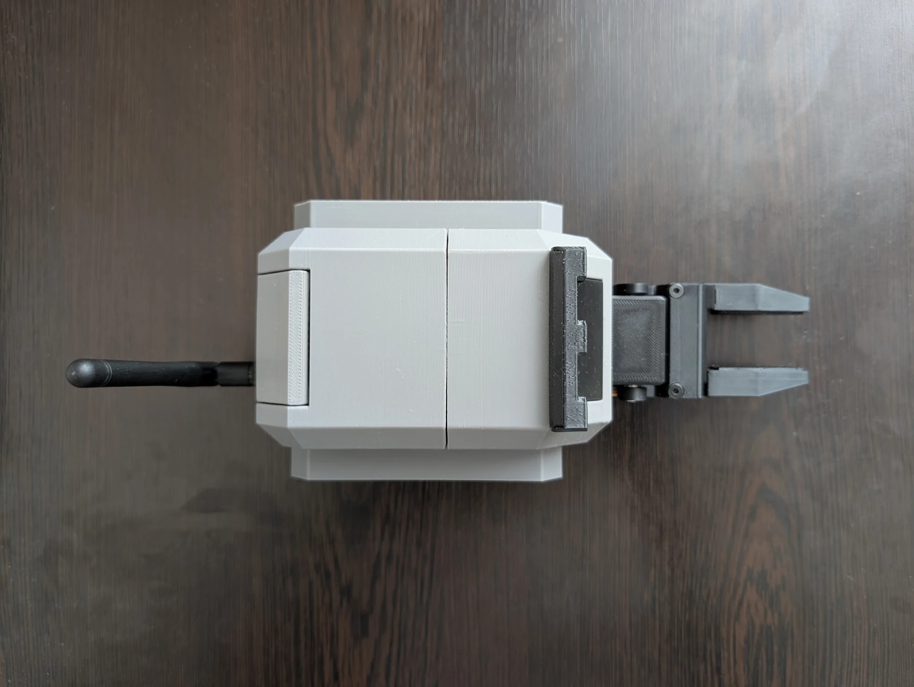 | 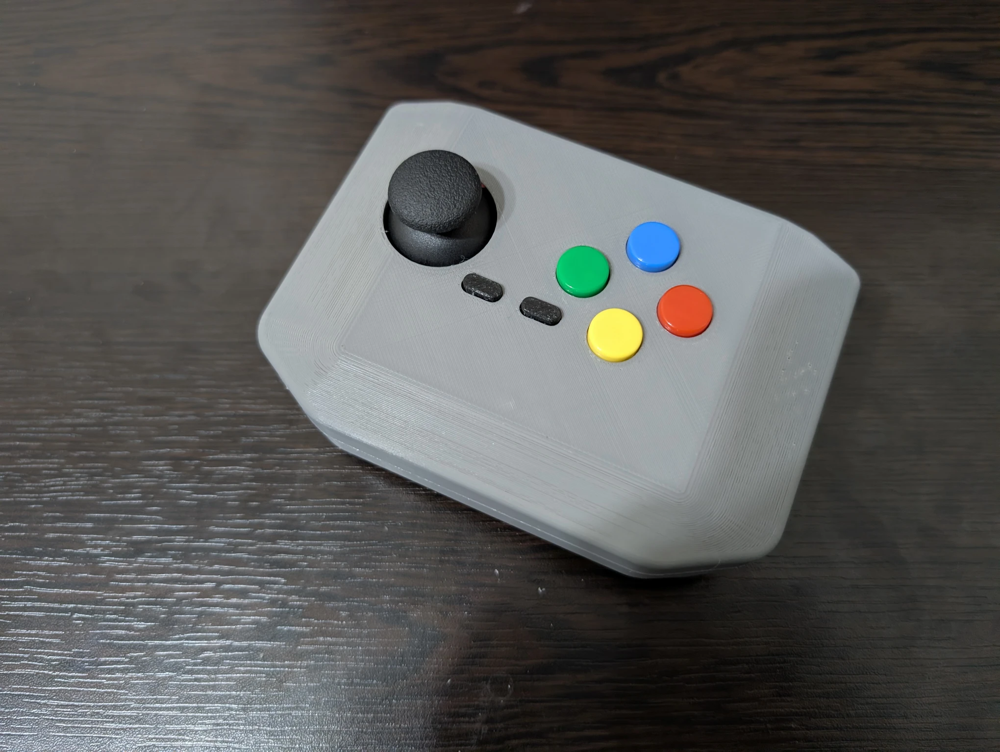 |
| 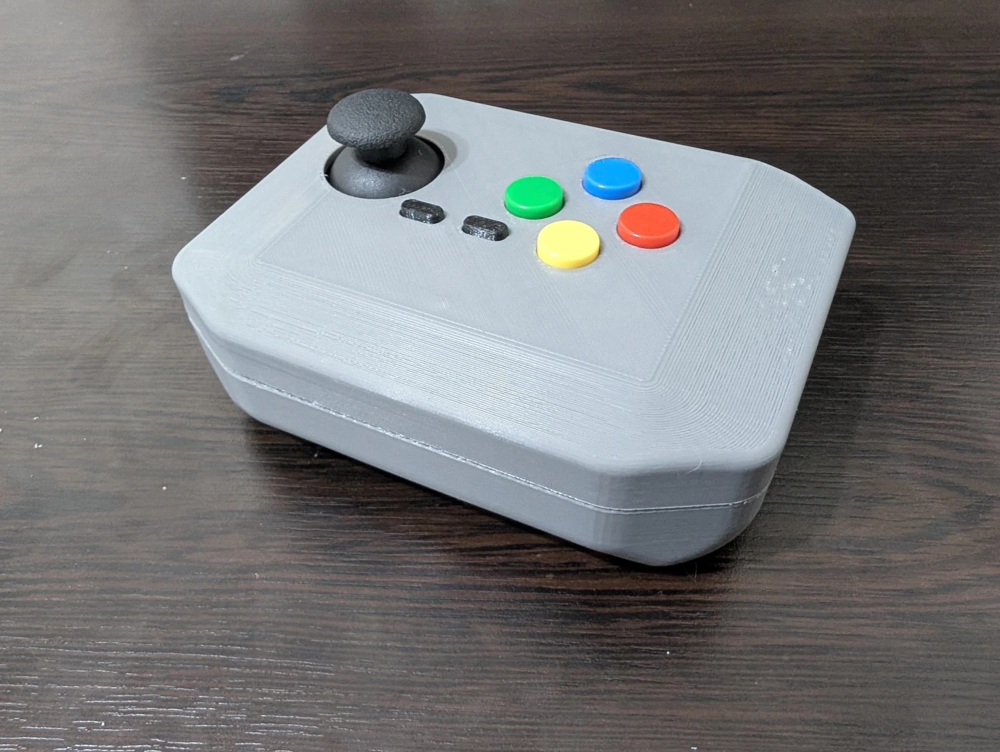 | 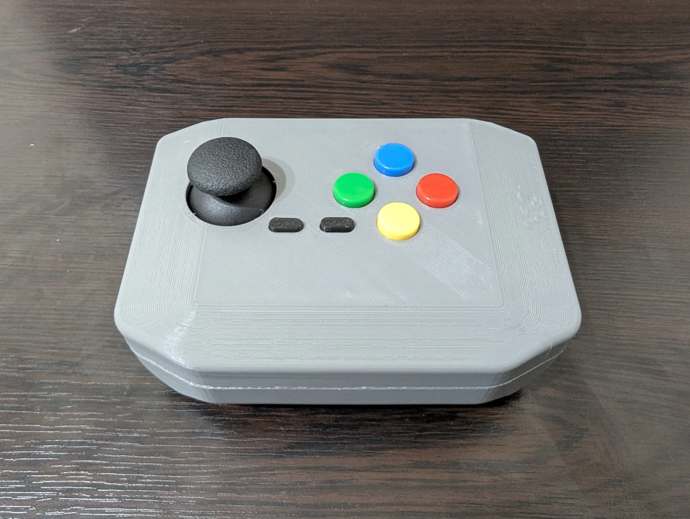 | 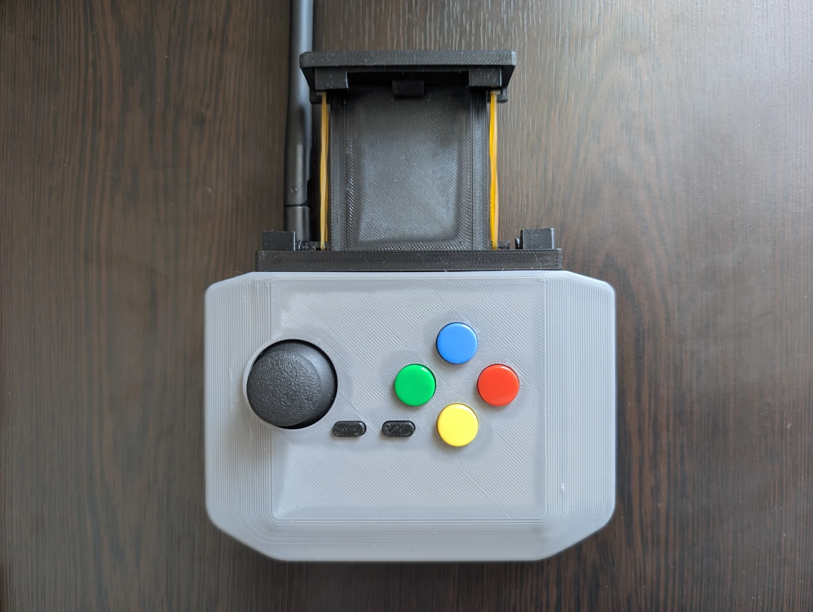 |

Documentation
-------------

* [Parts list](/docs/parts-list.md)
* [3D printable parts](/docs/3d-print.md)
* [Assembly](/docs/assembly.md)
* [Software](/docs/software.md)
